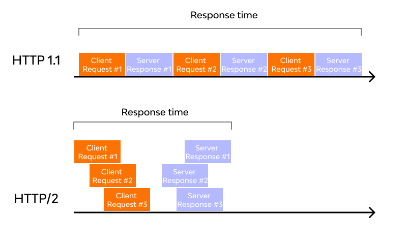

# 1. Write a blog on Difference between HTTP1.1 vs HTTP2

## HTTP/1.1 and HTTP/2 Main Differences

Launching of the HTTP/2 was an attempt to overcome the limitations of HTTP/1.1 and make it a more efficient web protocol. So, the major differences in these two are mainly the additions or upgrades applied in HTTP/2.

### HTTP/1.1

HTTP protocol was developed in 1989 as the common language that enables client and server machines interaction. Process steps are as enlisted:

1. The client (browser) has to send a request to the server using the method (GET/POST).
2. Server responds with the requested resource, for example – image, alongside the status of what it did to the client’s request.

This is not a one-time process. Such requests and responses needs to be transferred between both these machines until the client receives all the resources, essential to load a web page on the end-user’s (your) screen. This request-response exchange can be regarded as an IP stack being handled by transfer layer and networking layers before finally reaching to the application layer.

### HTTP/2

HTTP/2 was released at Google as the significant improvement of its predecessor. It was initially modeled after the SPDY protocol and went through significant changes to include features like multiplexing, header compression, and stream prioritization to minimize page load latency. After its release, Google announced that it would not provide support for SPDY in favor of HTTP/2.

The major feature that differentiates HTTP/2 from HTTP/1.1 is the binary framing layer. Unlike HTTP/1.1, HTTP/2 uses a binary framing layer. This layer encapsulates messages – converted to its binary equivalent – while making sure that its HTTP semantics (method details, header information, etc.) remain untamed. This feature of HTTP/2 enables gRPC to use lesser resources.

HTTP/1.1 sends messages as plain text, and HTTP/2 encodes them into binary data and arranges them carefully. This implies that HTTP/2 can have various delivery models. Most of the time, a client's initial response in return for an HTTP GET request is not the fully-loaded page. Fetching additional resources from the server requires that the client send repeated requests, break or form the TCP connection repeatedly for them. This process will consume lots of resources and time.



- **Multiplexing:** HTTP/1.1 loads resources one after the other, so if one resource cannot be loaded, it blocks all the other resources behind it. In contrast, HTTP/2 is able to use a single TCP connection to send multiple streams of data at once so that no one resource blocks any other resource. HTTP/2 does this by splitting data into binary-code messages and numbering these messages so that the client knows which stream each binary message belongs to.


- **Server push:** Typically, a server only serves content to a client device if the client asks for it. However, this approach is not always practical for modern webpages, which often involve several dozen separate resources that the client must request. HTTP/2 solves this problem by allowing a server to "push" content to a client before the client asks for it. The server also sends a message letting the client know what pushed content to expect – like if Bob had sent Alice a Table of Contents of his novel before sending the whole thing.
- **Header compression:** Small files load more quickly than large ones. To speed up web performance, both HTTP/1.1 and HTTP/2 compress HTTP messages to make them smaller. However, HTTP/2 uses a more advanced compression method called HPACK that eliminates redundant information in HTTP header packets. This eliminates a few bytes from every HTTP packet. Given the volume of HTTP packets involved in loading even a single webpage, those bytes add up quickly, resulting in faster loading.
- **Prioritization:** Prioritization refers to the order in which pieces of content are loaded. Prioritization affects a webpage's load time. For example, certain resources, like large JavaScript files, may block the rest of the page from loading if they have to load first. More of the page can load at once if these render-blocking resources load last. In HTTP/2, developers have hands-on, detailed control over prioritization. This allows them to maximize perceived and actual page load speed to a degree that was not possible in HTTP/1.1. HTTP/2 offers a feature called weighted prioritization. This allows developers to decide which page resources will load first, every time.

# 2. Write a blog about objects and its internal representation in Javascript

## Objects in Javascript

- `Objects` in JavaScript may be defined as an unordered collection of related data, of primitive (Number, String, Boolean, null, undefined and symbol) or reference types, in the form of “key: value” pairs. These keys can be variables or functions and are called properties and methods, respectively, in the context of an object.
- In JavaScript, `objects` are collections of key-value pairs, where keys are strings (or symbols) and values can be of any data type, including other objects. Objects are used to represent real-world entities, data structures, and more complex data types.

```
const person = {
  name: "Pradeesh Kumar R",
  age: 30,
  email: "pradeeshkumarr7@gmail.com"
};
```

## Internal Representation of Objects

- Internally, JavaScript engines use various data structures to represent objects efficiently. One common approach is using a hash table or a similar structure to store the object’s properties and their corresponding values. This allows for fast access and manipulation of properties.

```
Internal Representation:
{
  name: "Pradeesh Kumar R",
  age: 30,
  email: "pradeeshkumarr7@gmail.com"
}
```
